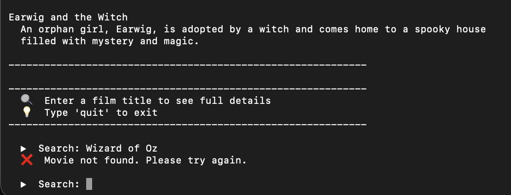
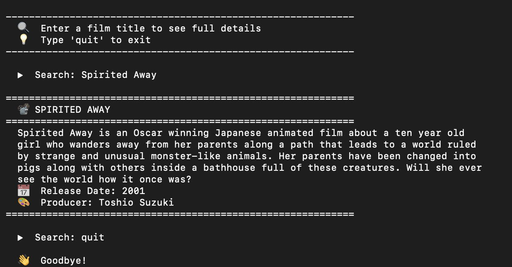
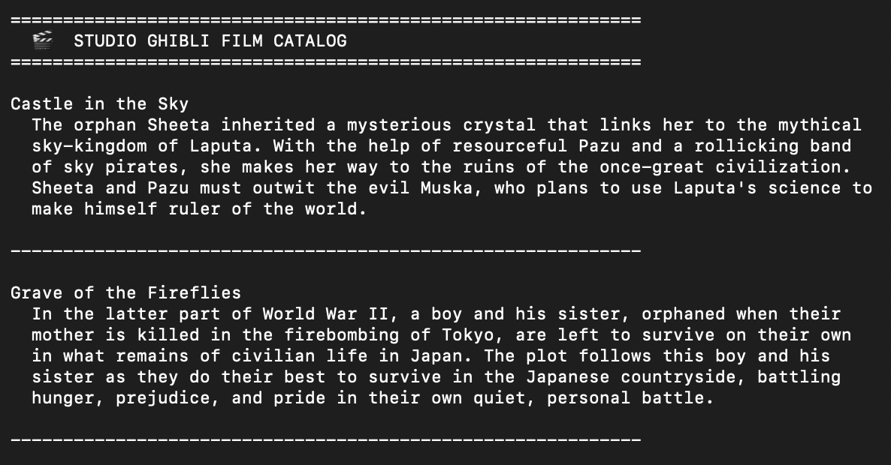

# Studio Ghibli Film Catalog

A Java command-line application that connects to the Studio Ghibli API to display a catalog of films and provide detailed information about each movie.

## Features

- **List all films** – Display all Studio Ghibli films with their full descriptions
- **Search by title** – Find a specific film and view its details (description, release date, producer)
- **Clean formatting** – Professional, readable output with word-wrapped descriptions
- **Error handling** – Graceful handling of API failures and user input

## Technologies

- **Java** – Core language
- **Gson** – JSON parsing library
- **Studio Ghibli API** – Data source ([ghibliapi.vercel.app](https://ghibliapi.vercel.app))

## Prerequisites

- **Java 8 or higher** ([Download](https://www.oracle.com/java/technologies/downloads/))
- **Gson library** (included in the `lib/` folder)

## How to Run

### 1. Clone the repository

`git clone https://github.com/yourusername/StudioGhibliAPI.git`

`cd StudioGhibliAPI`

### 2. Compile the program

**Mac / Linux:**

`javac -cp ".:lib/gson-2.9.1.jar" App.java`

**Windows:**

`javac -cp ".;lib/gson-2.9.1.jar" App.java`

### 3. Run the program

**Mac / Linux:**

`java -cp ".:lib/gson-2.9.1.jar" App`

**Windows:**

`java -cp ".;lib/gson-2.9.1.jar" App`

## How to Use

1. **View the catalog** – All films are displayed with their titles and descriptions
2. **Search for a film** – Type a title (e.g., `Spirited Away`) and press Enter
3. **Exit the program** – Type `quit` at any time

## 📸 Example Output
The application displays all Studio Ghibli films with their full descriptions. The catalog view gives users a complete overview of available films, with descriptions wrapped for readability.

Note: The catalog includes all 22 Studio Ghibli films. Only the first two are shown in the screenshot above for readability.

Users can search for a specific film by title. Here, "Spirited Away" returns detailed information including description, release date, and producer. The search feature demonstrates real-time API querying.

The program provides clear feedback when users exit, confirming the session has ended gracefully.

The application gracefully handles invalid input. If a user searches for a film title that does not exist in the Studio Ghibli API, the program displays a clear error message: "❌ Movie not found. Please try again." This provides immediate feedback and allows the user to continue searching without interruption.

The application's error handling in action — searching for "Wizard of Oz" (not a Studio Ghibli film) returns a clear "Movie not found" message and prompts the user to try again.
